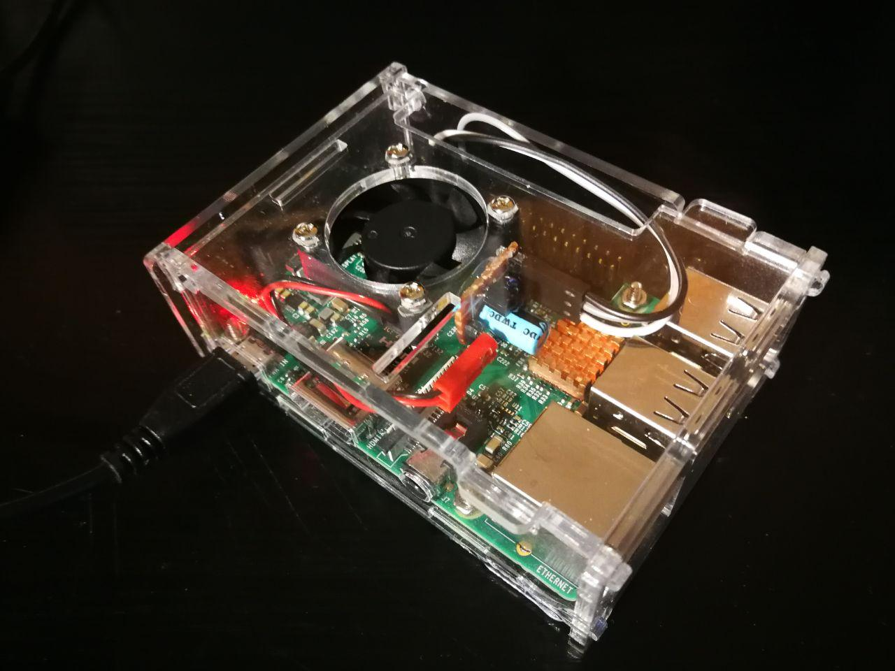
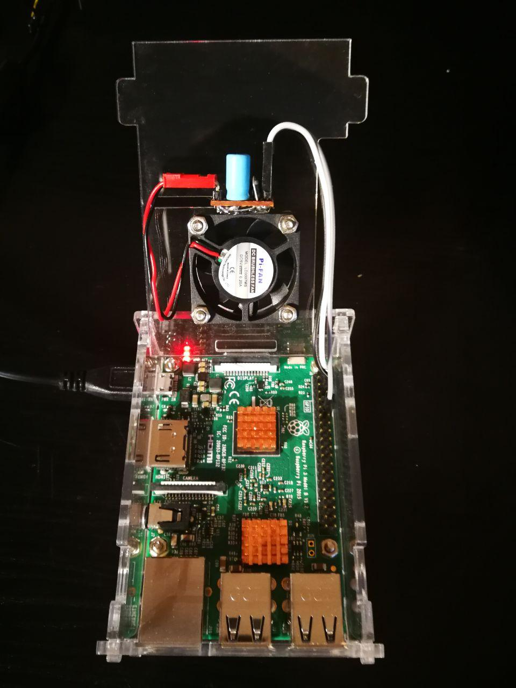

# Raspberry Pi 3 automatic fan control
Automatic fan control based on CPU temperature using PWM signal



## Create circuit
Circuit sketch:


Final circuit:


## Write Python script
I used Python 3.5 for my code. See the code in fancontrol.py.


## Run script on startup
You will need to add startup script as root because of GPIO pins (more sophisticated permissions would be nice if you care more about security, e.g. create a group, allow GPIO pin access to the group, then add your user to the group). Now I want to keep it simple.
```console
bana@banarpi:~ $ sudo su
```

Edit root´s crontab file:
```console
root@banarpi:/home/bana# crontab -e
```

Add the following line to your crontab file which will always start to run in background on startup:
```shell
...
@reboot python /location/to/file/fancontrol.py /location/to/file/config.json
```